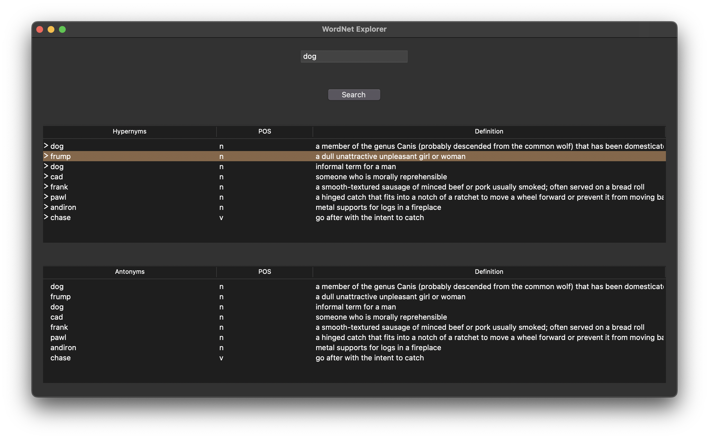
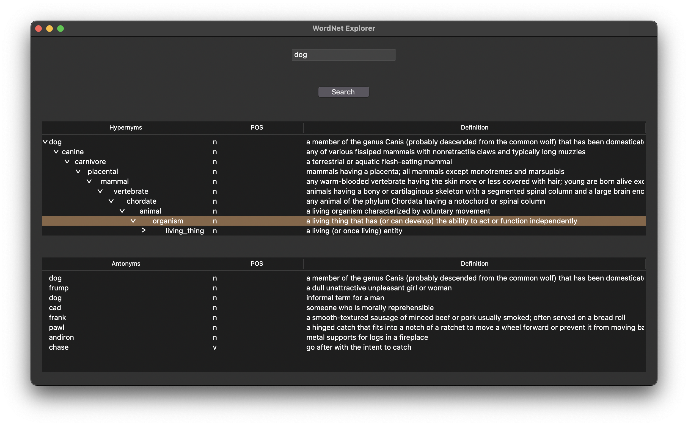
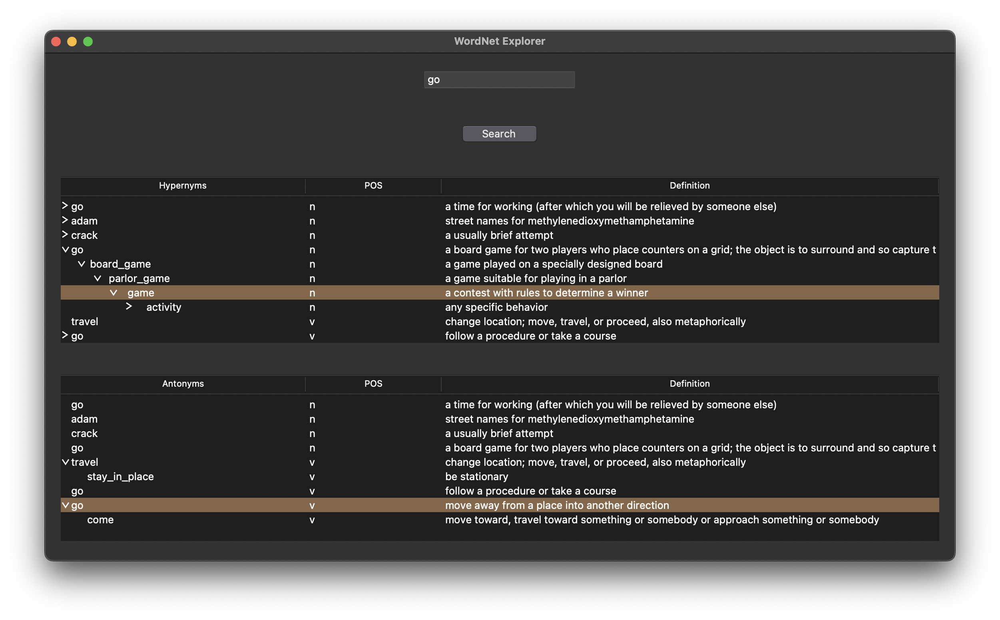

## Elijah's NLP Portfolio

This is a repo for the work I do for CS195 during Fall '23 semester at Drake.

**Dependencies are managed with Poetry**  
To run locally you can :
`git clone https://github.com/elijah-lueders/NLP.git`
`cd NLP`
`poetry install`
`poetry shell`

---

### Fortnight 1

**✅ Core Practices** _5 XP_

- [Elijah_F1_1_HuggingFace](Elijah_F1_1_HuggingFace.ipynb)
- [Elijah_F1_2_DataEvaluation](Elijah_F1_2_DataEvaluation.ipynb)
- [Elijah_F1_3_RougeSummarization](Elijah_F1_3_RougeSummarization.ipynb)

**✅ Applied Exploration** _5 XP_

- [Elijah_F1_AppliedExploration](Elijah_F1_AppliedExploration.ipynb)

**Demo Day -- 9.12**  
Who: Conrad / Saul / Katja / Caitlyn  
What: Applied Exploration

🏆 **10 XP TOTAL** 🏆

---

### Fortnight 2

**✅ Core Practices** _5 XP_

- [Elijah_F2_1_MoreOnDatasets](Elijah_F2_1_MoreOnDatasets.ipynb)
- [Elijah_F2_2_SummarizationTranslationQuestionAnswering](Elijah_F2_2_SummarizationTranslationQuestionAnswering.ipynb)
- [Elijah_F2_3_QuestionAnswering](Elijah_F2_3_QuestionAnswering.ipynb)
- [Elijah_F2_4_MarkovModel](Elijah_F2_4_MarkovModel.ipynb)

**✅ Applied Exploration** _5 XP_

- [Found in F2_2](Elijah_F2_2_SummarizationTranslationQuestionAnswering.ipynb#top)

**Demo Day -- 9.26**  
I missed this day.

🏆 **10 XP TOTAL** 🏆

---

### Fortnight 3

**✅ Core Practices** _5 XP_

- [Elijah_F3_1_Tokenization](Elijah_F3_1_Tokenization.ipynb)
- [Elijah_F3_2_AutoTokenization](Elijah_F3_2_AutoTokenization.ipynb)
- [Elijah_F3_3_HMMPOS](Elijah_F3_3_HMMPOS.ipynb)

**✅ Applied Exploration** _5 XP_

- **✅ Extended Implementation** _5 XP_
- [Found at the bottom of F3_2](Elijah_F3_2_AutoTokenization.ipynb)
  **Demo Day -- 10.10**  
  Who: Riley / Gonzalo  
  What: Extended Implementation

🏆 **15 XP TOTAL** 🏆

---

### Fortnight 4

**✅ Core Practices** _5 XP_

- [Elijah_F4_1_WordNet](Elijah_F4_1_WordNet.ipynb)
- [Elijah_F4_2_WordSenseDisambiguation](Elijah_F4_2_WordSenseDisambiguation.ipynb)
- [Elijah_F4_3_ContextFreeGrammars](Elijah_F4_3_ContextFreeGrammars.ipynb)

**✅ Applied Exploration** _5 XP_

**✅ Small Project Prototype** _5 XP_

- [WordNet GUI](Elijah_F4_Demo_WordNetExplorerGUI.py)
- allows you to type in a word 
- first window displays all the hypernyms which expand to show the hierarchy down to the root
- second window shows all the hypernyms which expand to show an antonym if it has one
    - antonyms didn't work as I hoped -- i wanted it to list all antonyms and then show there WordNet tree

  
  
  

  **Demo Day -- 10.24**  
  Who: Jack / Riley / Gonzalo  
  What: Small Project

🏆 **15 XP TOTAL** 🏆

---

### Fortnight 5

**✅ Core Practices** _5 XP_

- [Elijah_F5_1_Parsing](Elijah_F5_1_Parsing.ipynb)
- [Elijah_F5_2_MachineLearning](Elijah_F5_2_MachineLearning.ipynb)
- [Elijah_F5_3_NeuralNetworks](Elijah_F5_3_NeuralNetworks.ipynb)
- [Elijah_F5_4_Embeddings](Elijah_F5_4_Embeddings.ipynb)

**✅ Applied Exploration** _5 XP_
**Demo Day -- 11.7**  
Group: Cooper / Jack / Saul
Work: [WIP: Elijah_F5_Demo](Elijah_F5_Demo.ipynb)

🏆 **10 XP TOTAL** 🏆

---

### Fortnight 6

**✅ Core Practices** _5 XP_

- [Elijah_F6_1_NeuralLanguageModeling](Elijah_F6_1_NeuralLanguageModeling.ipynb)
- [Elijah_F6_2_RecurrentNeuralNetworks](Elijah_F6_2_RecurrentNeuralNetworks.ipynb)
- [Elijah_F6_3_EncoderDecoder](Elijah_F6_3_EncoderDecoder.ipynb)
- [Elijah_F6_4_LongTermRecurrence](Elijah_F6_4_LongTermRecurrence.ipynb)

**✅ Applied Exploration** _5 XP_

**Demo Day -- 11.xx**  
Group:  
I demoed [this notebook](Elijah_F1_Demo.ipynb)

🏆 **00 XP TOTAL** 🏆

---

### Fortnight 7

**✅ Core Practices** _5 XP_

- [Elijah_F7_1_TransferLearning](Elijah_F7_1_TransferLearning.ipynb)
- [Elijah_F7_2_AttentionTransformers](Elijah_F7_2_AttentionTransformers.ipynb)
- [Elijah_F7_3_ConversationalModels](Elijah_F7_3_ConversationalModels.ipynb)

**✅ Applied Exploration** _5 XP_

**Demo Day -- 12.xx**  
Group:  
I demoed \_\_. The work can be found [here](code).

🏆 **00 XP TOTAL** 🏆

---
